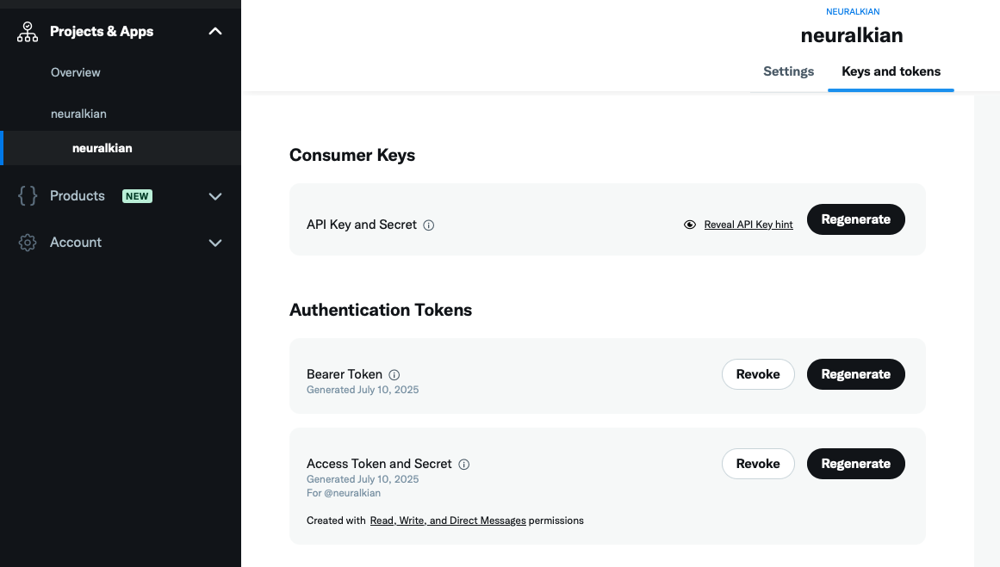

# Tweepy CLI

## Setup

Make a free account and project at https://developer.x.com and get the below keys:



```
export TWEEPY_BEARER_TOKEN="<your_bearer_token>"
export TWEEPY_CONSUMER_KEY="<your_consumer_key>"
export TWEEPY_CONSUMER_SECRET="<your_consumer_secret>"
export TWEEPY_ACCESS_TOKEN="<your_access_token>"
export TWEEPY_ACCESS_TOKEN_SECRET="<your_access_token_secret>"
```

Add them to your `~/.zshrc` or .env file:

> if you add to config file:
```sh
source ~/.zshrc
```

## Usage

```sh
uv sync
uv run tweet.py "your tweet here"
```